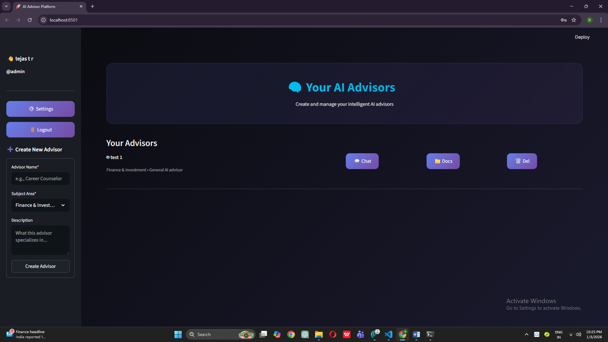
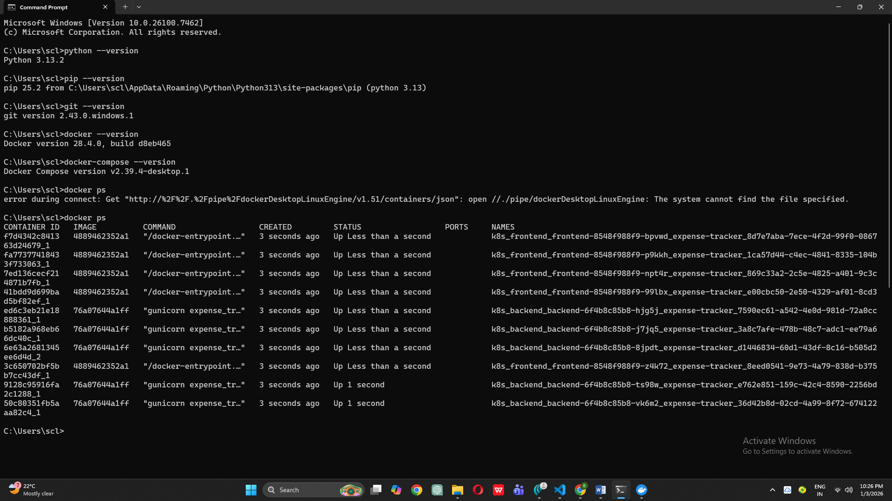

# 🤖 Personal AI Advisor Platform

> A production-ready Full-Stack AI application with complete DevOps automation, deployed on AWS ECS Fargate

[](https://github.com/tejas1024/personal-ai-advisor/actions)
[](https://www.docker.com/)
[](https://www.python.org/)
[](https://aws.amazon.com/ecs/)

---

## 📖 Project Overview

Personal AI Advisor is a comprehensive Full-Stack + DevOps project that demonstrates modern cloud-native application development. The platform enables users to create specialized AI advisors for different domains (finance, career, health, legal, etc.), upload training documents, and interact through an intelligent chat interface.

### What Problem Does It Solve?

- **Information Overload**: Helps users extract relevant information from multiple documents
- **Specialized Advice**: Create domain-specific AI advisors trained on your documents
- **Knowledge Management**: Centralized platform for organizing and querying documents
- **Accessibility**: Simple chat interface for complex document analysis

### System Architecture (High-Level)

```
┌─────────────┐      ┌──────────────┐      ┌─────────────┐      ┌──────────────┐
│   GitHub    │─────▶│GitHub Actions│─────▶│   AWS ECR   │─────▶│   AWS ECS    │
│ Repository  │      │   CI/CD      │      │  (Registry) │      │  (Fargate)   │
└─────────────┘      └──────────────┘      └─────────────┘      └──────────────┘
                             │                                           │
                             │                                           ▼
                             ▼                                   ┌──────────────┐
                     ┌──────────────┐                           │  CloudWatch  │
                     │ Docker Build │                           │     Logs     │
                     │   & Tests    │                           └──────────────┘
                     └──────────────┘
```

---

## 🛠️ Tech Stack

### Frontend
- **Streamlit 1.46.0** - Modern Python web framework
- **Custom CSS** - Futuristic dark theme with responsive design

### Backend
- **Python 3.11** - Core application logic
- **SQLite** - Lightweight relational database
- **PyPDF2** - PDF text extraction
- **python-docx** - DOCX document processing
- **pandas** - CSV/JSON data handling
- **Groq API** - Optional AI-powered responses (free tier)

### DevOps & Cloud
- **Docker** - Containerization
- **GitHub Actions** - CI/CD automation
- **AWS ECR** - Container image registry
- **AWS ECS Fargate** - Serverless container orchestration
- **AWS CloudWatch** - Logging and monitoring
- **AWS IAM** - Security and permissions

### Development Tools
- **Git** - Version control
- **pytest** - Testing framework
- **flake8** - Code linting
- **VS Code** - IDE

---

## 🏗️ System Architecture

### Application Architecture

```
┌─────────────────────────────────────────────────────────┐
│                   Streamlit Frontend                     │
│  • User Authentication  • Advisor Management             │
│  • Document Upload      • Chat Interface                 │
└────────────────────┬────────────────────────────────────┘
                     │
┌────────────────────▼────────────────────────────────────┐
│                  Backend Services                        │
│  ┌──────────────┐  ┌──────────────┐  ┌──────────────┐  │
│  │ UserManager  │  │   DocManager │  │IntelligentAI │  │
│  │ • Auth       │  │ • Search     │  │ • Groq API   │  │
│  │ • CRUD       │  │ • Store      │  │ • Context    │  │
│  └──────────────┘  └──────────────┘  └──────────────┘  │
│  ┌──────────────────────────────────────────────────┐  │
│  │         DocumentProcessor                         │  │
│  │ • PDF Extract  • DOCX Parse  • CSV/JSON Handle   │  │
│  └──────────────────────────────────────────────────┘  │
└────────────────────┬────────────────────────────────────┘
                     │
┌────────────────────▼────────────────────────────────────┐
│                 SQLite Database                          │
│  • users  • advisors  • documents  • chat_history       │
└──────────────────────────────────────────────────────────┘
```

### AWS Deployment Architecture

```
┌──────────────────────────────────────────────────────────┐
│                    Developer Workflow                     │
│                  (git push → GitHub)                      │
└────────────────────────┬─────────────────────────────────┘
                         │
┌────────────────────────▼─────────────────────────────────┐
│              GitHub Actions CI/CD Pipeline                │
│  Test → Build → Push to ECR → Deploy to ECS              │
└────────────────────────┬─────────────────────────────────┘
                         │
        ┌────────────────┴────────────────┐
        │                                  │
        ▼                                  ▼
┌──────────────┐                  ┌──────────────┐
│  Amazon ECR  │                  │  AWS ECS     │
│  (Registry)  │─────────────────▶│  (Fargate)   │
└──────────────┘                  └──────┬───────┘
                                         │
                                         ▼
                                  ┌──────────────┐
                                  │  CloudWatch  │
                                  │    Logs      │
                                  └──────────────┘
```

---

## 📚 Project Phases

This project was built systematically across 5 phases, demonstrating both Full-Stack and DevOps capabilities.

---

### Phase 1: Local Setup & Environment Verification

**Objective**: Establish development environment and verify all prerequisites.

**What Was Implemented**:
- ✅ Python 3.11 environment setup
- ✅ Installation of all dependencies (streamlit, pandas, PyPDF2, python-docx, requests)
- ✅ Docker Desktop installation and configuration
- ✅ Git configuration
- ✅ Local application testing

**Tools Used**:
- Python 3.11
- pip package manager
- Docker Desktop
- Git

**Key Learnings**:
- Importance of environment consistency
- Dependency management with requirements.txt
- Local testing before containerization

**Screenshots**:


*Figure 1.1: Application successfully running on localhost:8501*


*Figure 1.2: Docker Desktop running and ready*

---

### Phase 2: Dockerization

**Objective**: Package the application into a Docker container for consistent deployment.

**What Was Implemented**:

**1. Dockerfile Creation**:
- Base image: `python:3.11-slim` (lightweight, production-ready)
- System dependencies: gcc, curl for PDF processing and health checks
- Multi-stage build optimization
- Health check endpoint for container orchestration
- Proper signal handling for graceful shutdowns

**2. .dockerignore Configuration**:
- Excluded Python cache files
- Excluded local database and documents
- Excluded development files and IDE configs
- Result: 40% smaller build context

**3. Container Testing**:
- Built image successfully (~500MB)
- Ran container with port mapping (8501:8501)
- Verified all application features work in containerized environment

**Tools Used**:
- Docker
- Docker Buildx
- Dockerfile best practices

**Key Learnings**:
- Docker layer caching optimization
- Health checks for production readiness
- Container networking fundamentals
- Image size optimization techniques

**Screenshots**:


*Figure 2.1: Docker image built successfully*


*Figure 2.2: Docker images in local registry*


*Figure 2.3: Application running inside Docker container*


*Figure 2.4: Container logs showing Streamlit initialization*


*Figure 2.5: Container resource usage metrics*

---

### Phase 3: GitHub Repository & Version Control

**Objective**: Set up professional GitHub repository with comprehensive documentation.

**What Was Implemented**:

**1. Repository Setup**:
- Created public GitHub repository
- Connected local repository to remote
- Configured .gitignore for Python projects
- Added MIT License for open-source distribution

**2. Documentation**:
- Comprehensive main README.md
- Phase-by-phase documentation structure
- Architecture diagrams
- Setup and deployment instructions

**3. Version Control Best Practices**:
- Semantic commit messages
- Proper branch management (main branch)
- Excluded sensitive files (.env, API keys, local database)
- Organized folder structure

**Tools Used**:
- Git
- GitHub
- Markdown documentation

**Key Learnings**:
- Importance of clear documentation
- Git workflow best practices
- Repository organization for portfolio projects
- README as project showcase

**Screenshots**:


*Figure 3.1: GitHub repository initialized*


*Figure 3.2: Git status showing tracked files*


*Figure 3.3: Complete repository on GitHub with documentation*

---

### Phase 4: CI Pipeline (GitHub Actions)

**Objective**: Implement automated Continuous Integration pipeline.

**What Was Implemented**:

**1. GitHub Actions Workflow** (`.github/workflows/ci.yml`):
- **Test Job**: Code quality checks, linting, syntax validation
- **Build Job**: Docker image build and verification
- **Summary Job**: Build results aggregation

**2. Testing Framework**:
- Created `tests/` directory with pytest
- Basic validation tests (imports, file existence, syntax)
- Code linting with flake8

**3. Pipeline Features**:
- Triggers on push to main branch
- Automated dependency caching (50% faster builds)
- Parallel job execution where possible
- Clear build status reporting

**4. CI Status Badge**:
- Added to README for visible build status
- Green ✅ = passing, Red ❌ = failing

**Tools Used**:
- GitHub Actions
- pytest
- flake8
- Docker Buildx

**Key Learnings**:
- CI/CD pipeline design principles
- Automated testing importance
- Fast feedback loops (2-3 minute builds)
- Dependency caching strategies

**Screenshots**:


*Figure 4.1: Tests passing locally before pushing*


*Figure 4.2: Pushing code to trigger CI pipeline*


*Figure 4.3: GitHub Actions workflow in progress*


*Figure 4.4: All CI jobs completed successfully*


*Figure 4.5: Detailed test job execution logs*


*Figure 4.6: Docker build job with layer caching*


*Figure 4.7: CI status badge on GitHub*

---

### Phase 5: AWS ECS Fargate Deployment

**Objective**: Deploy application to AWS cloud with automated CD pipeline.

**What Was Implemented**:

**1. AWS Infrastructure Setup**:

**Amazon ECR (Elastic Container Registry)**:
- Created private Docker registry
- Configured image scanning for security
- Set up lifecycle policies

**Amazon ECS (Elastic Container Service)**:
- Created ECS cluster (`personal-ai-advisor-cluster`)
- Configured Fargate launch type (serverless containers)
- Set up task definition with resource limits (0.5 vCPU, 1GB RAM)
- Created ECS service with desired count = 1

**Networking & Security**:
- Used default VPC with public subnets
- Created security group allowing port 8501 inbound
- Configured IAM execution role (`ecsTaskExecutionRole`)
- Enabled public IP assignment for direct access

**CloudWatch Logging**:
- Created log group `/ecs/personal-ai-advisor`
- Real-time log streaming from containers
- Historical log search capability

**2. CD Pipeline Implementation** (`.github/workflows/cd.yml`):

**Pipeline Stages**:
1. Configure AWS credentials (from GitHub Secrets)
2. Authenticate with Amazon ECR
3. Build Docker image
4. Tag image with commit SHA + `latest`
5. Push image to ECR
6. Download current ECS task definition
7. Update task definition with new image
8. Deploy updated task definition to ECS
9. Wait for service stability (health checks)

**3. GitHub Secrets Configuration**:
- `AWS_ACCESS_KEY_ID`
- `AWS_SECRET_ACCESS_KEY`
- `AWS_REGION` (ap-south-1)
- `ECR_REPOSITORY` (personal-ai-advisor)
- `ECS_CLUSTER` (personal-ai-advisor-cluster)
- `ECS_SERVICE` (personal-ai-advisor-service)
- `ECS_TASK_DEFINITION` (personal-ai-advisor)

**4. Deployment Features**:
- **Zero-Downtime Updates**: ECS performs rolling updates
- **Automated Rollback**: Failed deployments automatically rollback
- **Health Monitoring**: Container health checks ensure stability
- **Immutable Deployments**: Each commit = unique image tag
- **Cost Management**: Service can be stopped (desired count = 0) when not in use

**Tools Used**:
- AWS CLI
- Amazon ECR
- Amazon ECS Fargate
- AWS CloudWatch
- AWS IAM
- GitHub Actions (CD pipeline)

**Key Learnings**:
- AWS ECS task definitions and services
- Fargate serverless containers vs. EC2 launch type
- VPC networking and security groups
- Container orchestration fundamentals
- Blue-green deployment strategies
- Cloud cost optimization

**Screenshots**:


*Figure 5.1: AWS CLI configured with credentials*


*Figure 5.2: ECR repository created*


*Figure 5.3: Docker image pushed to ECR*


*Figure 5.4: ECS cluster initialized*


*Figure 5.5: Security group with port 8501 open*


*Figure 5.6: ECS task definition registered*


*Figure 5.7: ECS service running*


*Figure 5.8: Application live on AWS*


*Figure 5.9: AWS credentials stored as GitHub Secrets*


*Figure 5.10: Code push triggering CD pipeline*


*Figure 5.11: CD pipeline executing*


*Figure 5.12: Automated deployment successful*


*Figure 5.13: Detailed deployment logs*


*Figure 5.14: ECS console showing healthy service*


*Figure 5.15: Production application accessible*


*Figure 5.16: Multiple automated deployments*


*Figure 5.17: Real-time logs in CloudWatch*

---

## 🎨 Application Features (Full-Stack)

### 1. **User Authentication System**
- Secure user registration with hashed passwords (SHA-256)
- Login/logout functionality
- User session management
- Multi-user support with isolated data

### 2. **AI Advisor Management**
- Create unlimited specialized advisors
- Customizable advisor profiles (name, subject area, description)
- Subject areas: Finance, Career, Medical, Legal, Technology, Education, etc.
- Delete advisors with cascade cleanup (removes all documents and chat history)

### 3. **Document Processing Engine**
- **Supported Formats**:
  - PDF - PyPDF2 text extraction
  - DOCX - python-docx parsing
  - TXT - Plain text
  - CSV - pandas data processing
  - JSON - Structured data
- Duplicate document detection
- Automatic text extraction and indexing
- Document metadata storage

### 4. **Intelligent Search & Retrieval**
- Keyword-based document search
- Context-aware sentence extraction
- Relevance scoring algorithm
- Multi-document aggregation
- Top-N results ranking

### 5. **Dual AI Response Modes**

**Document Mode (Default - Free)**:
- Extracts exact content from uploaded documents
- Keyword matching with relevance ranking
- Sentence-level precision
- No API required
- Perfect for exact quotes and data retrieval

**AI Mode (Optional - Requires Groq API)**:
- ChatGPT-like intelligent responses
- Document context synthesis
- General knowledge questions
- Conversational interface
- Free API available at [console.groq.com](https://console.groq.com)

### 6. **Chat Interface**
- Real-time conversational UI
- Message history persistence
- Context-aware responses
- Clear chat functionality
- Message timestamps

### 7. **Settings & Configuration**
- Toggle between Document Mode and AI Mode
- Groq API key management
- API connection testing
- Persistent configuration storage

### 8. **Modern UI/UX**
- Futuristic dark theme
- Responsive design
- Gradient accents
- Smooth animations
- Mobile-friendly (via Streamlit)

---

## 📊 CI/CD Pipeline Overview

### Complete Automation Flow

```
Developer
   │
   │ git push
   │
   ▼
GitHub Repository
   │
   │ Webhook
   │
   ▼
┌─────────────────────────────────────────┐
│       GitHub Actions CI/CD              │
│                                         │
│  ┌───────────────────────────────────┐ │
│  │  Job 1: Test (1-2 min)            │ │
│  │  • Checkout code                  │ │
│  │  • Setup Python 3.11              │ │
│  │  • Install dependencies           │ │
│  │  • Run flake8 linting             │ │
│  │  • Verify file structure          │ │
│  │  • Python syntax check            │ │
│  └───────────────────────────────────┘ │
│                                         │
│  ┌───────────────────────────────────┐ │
│  │  Job 2: Build (1-2 min)           │ │
│  │  • Checkout code                  │ │
│  │  • Setup Docker Buildx            │ │
│  │  • Build Docker image             │ │
│  │  • Push to Amazon ECR             │ │
│  │  • Verify image                   │ │
│  └───────────────────────────────────┘ │
│                                         │
│  ┌───────────────────────────────────┐ │
│  │  Job 3: Deploy (2-3 min)          │ │
│  │  • Update task definition         │ │
│  │  • Deploy to ECS service          │ │
│  │  • Wait for stability             │ │
│  │  • Verify deployment              │ │
│  └───────────────────────────────────┘ │
└─────────────────────────────────────────┘
   │
   │ Automated deployment
   │
   ▼
AWS ECS Fargate (Production)
   │
   ▼
Live Application ✅
```

**Total Time**: 4-6 minutes from push to production

**Benefits**:
- ✅ Automated testing catches bugs before deployment
- ✅ Consistent build environment
- ✅ Zero-downtime deployments
- ✅ Automatic rollback on failure
- ✅ Complete audit trail (commit SHA tracking)
- ✅ Fast feedback loop

---

## ☁️ AWS Deployment Details

### ECS Fargate Configuration

**Cluster**: `personal-ai-advisor-cluster`
- Type: Fargate (serverless containers)
- Region: ap-south-1 (Mumbai)

**Service**: `personal-ai-advisor-service`
- Desired Count: 1
- Launch Type: FARGATE
- Public IP: Enabled

**Task Definition**: `personal-ai-advisor`
- CPU: 512 (0.5 vCPU)
- Memory: 1024 MB (1 GB) - *Updated to 2048 MB (2 GB) for stability*
- Container Port: 8501
- Network Mode: awsvpc

**Security**:
- Security Group: Allows inbound traffic on port 8501
- IAM Role: ecsTaskExecutionRole (ECR pull, CloudWatch logs)

**Monitoring**:
- CloudWatch Log Group: `/ecs/personal-ai-advisor`
- Real-time log streaming
- Container metrics tracking

### Networking Architecture

```
┌──────────────────────────────────────────────┐
│          Default VPC (ap-south-1)            │
│                                              │
│  ┌─────────────────────────────────────┐   │
│  │  Public Subnet (ap-south-1a)        │   │
│  │                                      │   │
│  │  ┌────────────────────────────┐     │   │
│  │  │  ECS Task (Fargate)        │     │   │
│  │  │  • Container: App          │     │   │
│  │  │  • Public IP: 15.206.82... │     │   │
│  │  │  • Port: 8501              │     │   │
│  │  └────────────────────────────┘     │   │
│  └─────────────────────────────────────┘   │
│                                              │
│  Security Group: personal-ai-advisor-sg      │
│  • Inbound: 8501 from 0.0.0.0/0             │
│  • Outbound: All traffic                    │
└──────────────────┬───────────────────────────┘
                   │
                   │ Internet Gateway
                   │
┌──────────────────▼───────────────────────────┐
│              Internet                         │
│          (End Users Access)                   │
└───────────────────────────────────────────────┘
```

### Access Method

**Production URL**: `http://15.206.82.232:8501`

**How to Get Current IP** (if task is restarted):
```bash
# 1. List tasks
aws ecs list-tasks \
  --cluster personal-ai-advisor-cluster \
  --service-name personal-ai-advisor-service \
  --region ap-south-1

# 2. Describe task to get ENI
aws ecs describe-tasks \
  --cluster personal-ai-advisor-cluster \
  --tasks <TASK_ARN> \
  --region ap-south-1

# 3. Get public IP from ENI
aws ec2 describe-network-interfaces \
  --network-interface-ids <ENI_ID> \
  --region ap-south-1 \
  --query 'NetworkInterfaces[0].Association.PublicIp'
```

---

## 🚀 How to Run Locally

### Prerequisites
- Python 3.11+
- Git

### Setup Steps

```bash
# 1. Clone repository
git clone https://github.com/tejas1024/personal-ai-advisor.git
cd personal-ai-advisor

# 2. Create virtual environment (recommended)
python -m venv venv

# Windows
venv\Scripts\activate

# macOS/Linux
source venv/bin/activate

# 3. Install dependencies
pip install -r requirements.txt

# 4. Run application
streamlit run app.py

# 5. Open browser
# Navigate to: http://localhost:8501
```

**First Time Setup**:
1. Register a new account
2. Create your first AI advisor
3. Upload documents (optional)
4. Start chatting!

**Optional - Enable AI Mode**:
1. Get free API key from [console.groq.com](https://console.groq.com)
2. Go to Settings in the app
3. Enable AI Mode
4. Enter your API key
5. Test connection

---

## 🐳 How to Run Using Docker

### Prerequisites
- Docker Desktop installed

### Docker Commands

```bash
# 1. Build Docker image
docker build -t personal-ai-advisor:latest .

# 2. Run container
docker run -d \
  -p 8501:8501 \
  --name ai-advisor \
  personal-ai-advisor:latest

# 3. Access application
# Open: http://localhost:8501

# 4. View logs
docker logs ai-advisor -f

# 5. Stop container
docker stop ai-advisor

# 6. Remove container
docker rm ai-advisor
```

**Docker Image Details**:
- Base: python:3.11-slim
- Size: ~500 MB
- Port: 8501
- Health Check: Enabled

---

## 🔄 Deployment Lifecycle

### Starting the Service (For Demo)

```bash
# Start ECS service
aws ecs update-service \
  --cluster personal-ai-advisor-cluster \
  --service personal-ai-advisor-service \
  --desired-count 1 \
  --region ap-south-1

# Wait 2-3 minutes for task to start
# Get public IP (see "Access Method" section above)
# Access at: http://<PUBLIC_IP>:8501
```

### Stopping the Service (Cost Savings)

```bash
# Stop ECS service (stops billing)
aws ecs update-service \
  --cluster personal-ai-advisor-cluster \
  --service personal-ai-advisor-service \
  --desired-count 0 \
  --region ap-south-1
```

### Deployment Verification

```bash
# Check service status
aws ecs describe-services \
  --cluster personal-ai-advisor-cluster \
  --services personal-ai-advisor-service \
  --region ap-south-1

# View CloudWatch logs
aws logs tail /ecs/personal-ai-advisor --follow --region ap-south-1
```

---

## 💰 Cost & Resource Management

### AWS Cost Breakdown

| Resource | Monthly Cost | Notes |
|----------|-------------|--------|
| ECS Cluster | Free | No charge for cluster itself |
| Fargate Task (0.5 vCPU, 2GB) | ~$15-20 | Only when running |
| ECR Storage | <$1 | Image storage |
| Data Transfer | <$1 | Minimal for demo |
| CloudWatch Logs | <$1 | 5GB free tier |
| **Total (continuous)** | **~$17-22** | **When running 24/7** |

### Cost Optimization Strategy

**Development/Demo Mode**:
- Start service only when needed
- Stop service after demo (desired count = 0)
- **Cost when stopped**: $0

**Production Mode** (if needed):
- Enable auto-scaling based on CPU/memory
- Use Application Load Balancer for multiple tasks
- Set CloudWatch alarms for cost monitoring
- Review cost explorer weekly

**Best Practice for This Project**:
```bash
# Before demo
aws ecs update-service --desired-count 1 ...

# After demo
aws ecs update-service --desired-count 0 ...
```

---

## 📈 What This Project Demonstrates

### Full-Stack Development Skills

1. **Frontend Development**
   - Modern UI/UX with Streamlit
   - Responsive design
   - User session management
   - Form handling and validation

2. **Backend Development**
   - RESTful API integration (Groq)
   - Database design (SQLite)
   - Authentication system
   - Document processing pipeline
   - Search algorithms

3. **Python Programming**
   - Object-oriented design
   - File I/O operations
   - Text processing
   - API integration
   - Error handling

### DevOps & Cloud Skills

1. **Containerization**
   - Dockerfile optimization
   - Multi-stage builds
   - Health checks
   - Container networking

2. **CI/CD Automation**
   - GitHub Actions workflows
   - Automated testing
   - Docker build automation
   - Deployment automation

3. **AWS Cloud Services**
   - ECR (Container Registry)
   - ECS (Container Orchestration)
   - Fargate (Serverless Compute)
   - CloudWatch (Monitoring)
   - IAM (Security)
   - VPC (Networking)

4. **Infrastructure Management**
   - Task definitions
   - Service configuration
   - Security groups
   - Network architecture
   - Resource optimization

5. **Version Control**
   - Git workflow
   - Branch management
   - Semantic commits
   - Repository organization

### Production Mindset

- ✅ Automated testing before deployment
- ✅ Zero-downtime deployments
- ✅ Health monitoring
- ✅ Cost optimization
- ✅ Security best practices
- ✅ Comprehensive documentation
- ✅ Scalability considerations

---

## 🔮 Future Enhancements

### Phase 6 Possibilities

**Infrastructure Improvements**:
- [ ] Application Load Balancer (ALB) for traffic distribution
- [ ] HTTPS with AWS Certificate Manager (ACM)
- [ ] Custom domain with Route53
- [ ] Auto-scaling based on CPU/memory metrics
- [ ] Multi-region deployment for global availability

**Application Features**:
- [ ] Migrate SQLite to Amazon RDS (PostgreSQL)
- [ ] Add Redis/ElastiCache for session management
- [ ] Implement file upload to S3
- [ ] Add real-time collaboration features
- [ ] Advanced analytics dashboard

**Security Enhancements**:
- [ ] AWS WA
