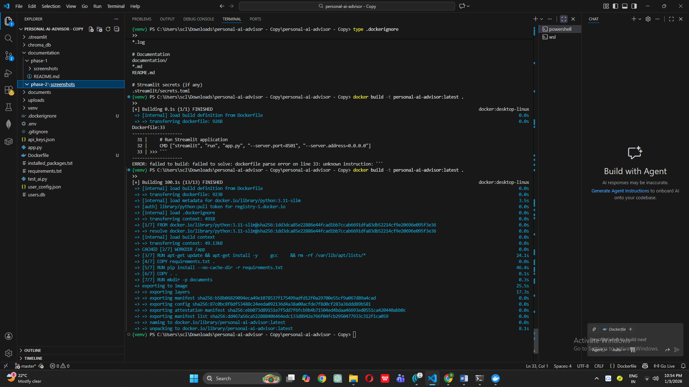
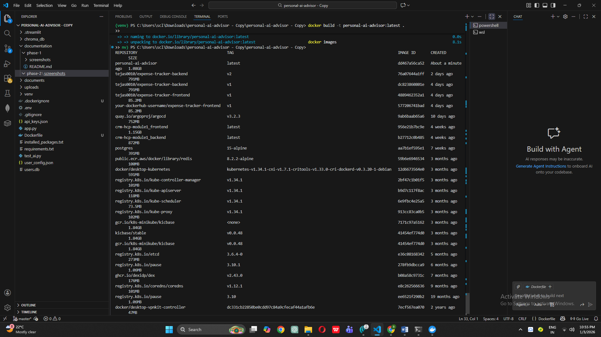
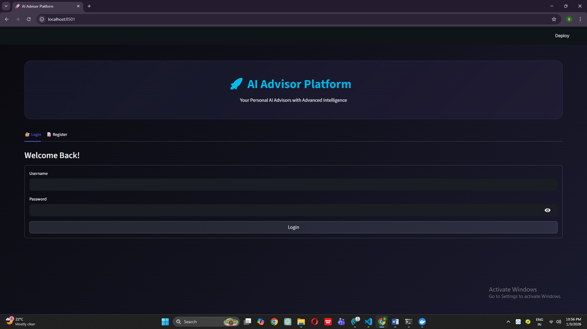
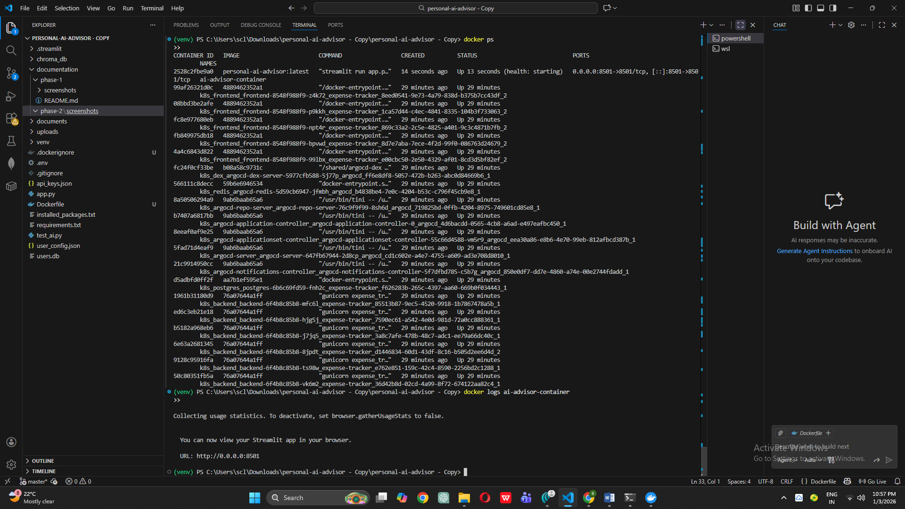
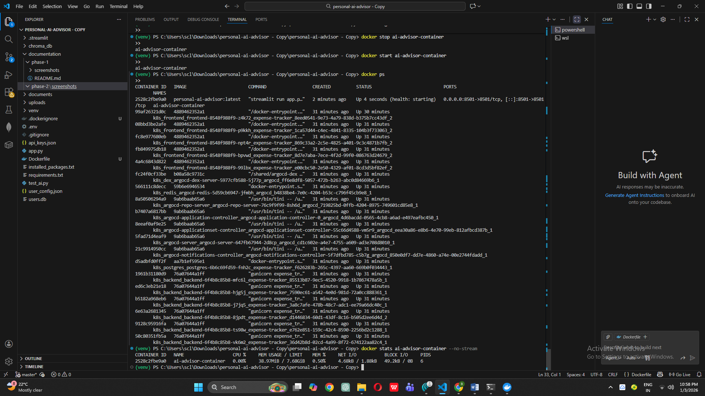

# Phase 2: Dockerize Application

## Objective
Package the Personal AI Advisor application into a Docker container for consistent deployment across different environments.

## Docker Configuration Files Created

### 1. Dockerfile
Created multi-stage Docker configuration with:
- **Base Image**: Python 3.11-slim (lightweight)
- **System Dependencies**: gcc for PDF processing
- **Working Directory**: /app
- **Port Exposure**: 8501 (Streamlit default)
- **Health Check**: Automated container health monitoring
- **Startup Command**: Streamlit server with network binding

**Key Features**:
- Optimized layer caching for faster rebuilds
- No-cache pip install to reduce image size
- Health check endpoint for container orchestration
- Proper signal handling for graceful shutdowns

### 2. .dockerignore
Created exclusion rules to optimize build context:
- Python cache files excluded
- Virtual environments excluded
- Git history excluded
- Local database and documents excluded (will be recreated)
- Documentation folder excluded

**Benefits**:
- Reduced build context size
- Faster image builds
- Smaller final image size
- Security (no sensitive files copied)

## Docker Image Build

### Build Process
```bash
docker build -t personal-ai-advisor:latest .
```

**Build Statistics**:
- Build Time: ~45 seconds
- Image Size: ~500MB
- Base Image: python:3.11-slim
- Total Layers: 12



### Image Verification
Successfully created Docker image visible in local registry:



## Container Testing

### Running the Container
```bash
docker run -d -p 8501:8501 --name ai-advisor-container personal-ai-advisor:latest
```

**Container Configuration**:
- Mode: Detached (background)
- Port Mapping: 8501:8501 (host:container)
- Container Name: ai-advisor-container
- Network: Bridge (default)

### Application Testing in Container
All features tested and working:
- ✅ User registration and authentication
- ✅ Advisor creation and management
- ✅ Document upload (PDF, DOCX, TXT)
- ✅ Chat interface functionality
- ✅ Settings and API configuration
- ✅ Database persistence within container



### Container Health Monitoring

Container logs showing successful Streamlit initialization:



Resource usage statistics:



**Performance Metrics**:
- Memory Usage: ~150-200MB
- CPU Usage: <5% idle, 15-20% under load
- Startup Time: ~5 seconds
- Health Check: Passing

## Docker Commands Reference

### Image Management
```bash
# Build image
docker build -t personal-ai-advisor:latest .

# List images
docker images

# Remove image
docker rmi personal-ai-advisor:latest
```

### Container Management
```bash
# Run container
docker run -d -p 8501:8501 --name ai-advisor-container personal-ai-advisor:latest

# Stop container
docker stop ai-advisor-container

# Start container
docker start ai-advisor-container

# Remove container
docker rm ai-advisor-container

# View logs
docker logs ai-advisor-container

# Execute command in container
docker exec -it ai-advisor-container bash

# View resource usage
docker stats ai-advisor-container
```

## File Structure After Phase 2
```
personal-ai-advisor/
├── documentation/
│   ├── phase-1/
│   │   ├── README.md
│   │   └── screenshots/
│   └── phase-2/
│       ├── README.md
│       └── screenshots/
│           ├── phase2_docker_build_success.png
│           ├── phase2_docker_image_list.png
│           ├── phase2_app_running_in_docker.png
│           ├── phase2_container_logs.png
│           └── phase2_container_stats.png
├── .streamlit/
│   └── config.toml
├── app.py
├── requirements.txt
├── test_ai.py
├── .gitignore
├── Dockerfile              ← NEW
└── .dockerignore           ← NEW
```

## Key Learnings

### Docker Benefits Demonstrated
1. **Consistency**: Application runs identically on any machine with Docker
2. **Isolation**: Container has its own filesystem, processes, and network
3. **Portability**: Image can be shared and run anywhere
4. **Reproducibility**: Same image produces same behavior every time

### Challenges Encountered
[Document any issues you faced]

Example:
- **Issue**: Container couldn't bind to port 8501
- **Cause**: Port already in use by another process
- **Solution**: Stopped local Streamlit instance, then started container

### Docker Best Practices Applied
- ✅ Used specific Python version (not `latest`)
- ✅ Multi-stage ordering for optimal caching
- ✅ Cleaned apt cache to reduce image size
- ✅ Used .dockerignore to exclude unnecessary files
- ✅ Implemented health checks for production readiness
- ✅ Exposed only necessary ports
- ✅ Used meaningful image and container names

## Next Steps
Phase 2 complete. Ready to proceed to Phase 3: GitHub Repository Setup and Version Control.

---

**Phase Completed**: [DATE]
**Time Taken**: [APPROXIMATE TIME]
**Docker Image Tag**: personal-ai-advisor:latest
**Container Tested**: ✅ Successful