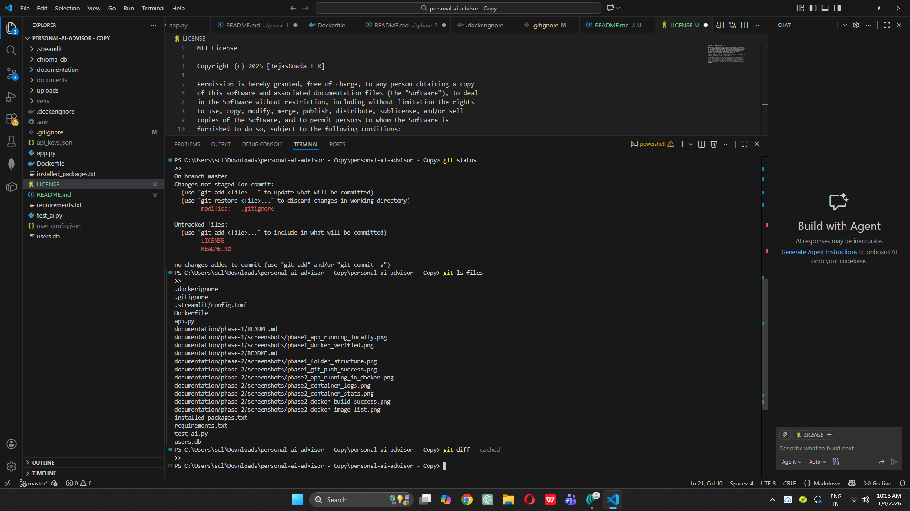
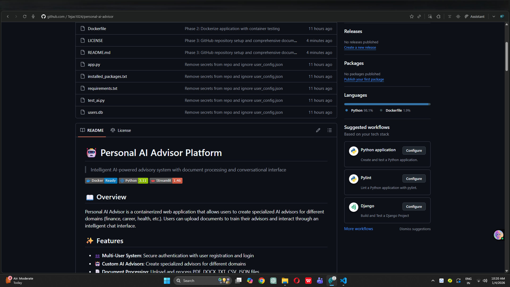

# Phase 3: GitHub Repository Setup & Version Control

## Objective
Set up professional GitHub repository with comprehensive documentation, proper version control practices, and complete project structure.

## Repository Setup

### Repository Information
- **Repository Name**: personal-ai-advisor
- **Visibility**: Public
- **Description**: Intelligent AI-powered advisory system with document processing
- **URL**: https://github.com/YOUR_USERNAME/personal-ai-advisor


### Remote Configuration
Successfully connected local repository to GitHub:
```bash
git remote add origin https://github.com/YOUR_USERNAME/personal-ai-advisor.git
git remote -v
```

## Documentation Created

### 1. Main README.md
Created comprehensive project README including:
- **Project Overview**: Clear description of purpose and functionality
- **Features List**: All key features documented
- **Architecture Diagram**: Visual representation of system design
- **Tech Stack**: Complete list of technologies used
- **Quick Start Guide**: Step-by-step setup instructions
- **Docker Instructions**: Build and run commands
- **Project Structure**: File organization
- **Configuration**: Settings and API setup
- **Database Schema**: Table structures documented
- **License**: MIT License
- **Author Information**: Contact and links
- **Acknowledgments**: Credits to tools and frameworks

### 2. LICENSE File
Added MIT License for open-source distribution.

### 3. Updated .gitignore
Enhanced .gitignore to exclude:
- Python cache files
- Virtual environments
- Local database files
- API keys and secrets
- IDE configuration
- OS-specific files
- Docker override files

## Version Control Best Practices Applied

### Git Configuration
✅ User name and email configured  
✅ Remote repository connected  
✅ .gitignore properly configured  
✅ All sensitive files excluded  

### Commit Strategy
Following semantic commit messages:
- `Phase 1: Environment setup and verification`
- `Phase 2: Dockerize application with container testing`
- `Phase 3: GitHub repository setup and documentation`

### Branch Strategy
Currently using `main` branch for linear development.

For future:
- `main`: Production-ready code
- `develop`: Integration branch
- `feature/*`: Feature branches
- `hotfix/*`: Emergency fixes

## Files Added/Modified in Phase 3

### New Files
- `README.md` (project root)
- `LICENSE`
- `documentation/phase-3/README.md`

### Modified Files
- `.gitignore` (enhanced)

### Files Tracked
```
.dockerignore
.gitignore
.streamlit/config.toml
app.py
documentation/phase-1/README.md
documentation/phase-1/screenshots/*
documentation/phase-2/README.md
documentation/phase-2/screenshots/*
documentation/phase-3/README.md
documentation/phase-3/screenshots/*
Dockerfile
LICENSE
README.md
requirements.txt
test_ai.py
```



## Repository Statistics

### Commit History
- Total Commits: 3 (after Phase 3)
- Branches: 1 (main)
- Contributors: 1

### Code Statistics
- Total Files: 15+
- Lines of Code: ~1,500+
- Documentation Files: 4
- Configuration Files: 5

## Git Commands Reference

### Daily Workflow
```bash
# Check status
git status

# Add files
git add .
git add <specific-file>

# Commit changes
git commit -m "descriptive message"

# Push to GitHub
git push origin main

# Pull latest changes
git pull origin main
```

### Viewing History
```bash
# View commit log
git log --oneline

# View specific file history
git log --follow <filename>

# View changes
git diff
```

### Branch Management
```bash
# List branches
git branch

# Create branch
git branch <branch-name>

# Switch branch
git checkout <branch-name>

# Create and switch
git checkout -b <branch-name>

# Merge branch
git merge <branch-name>
```

## GitHub Features Configured

### Repository Settings
- ✅ Public visibility for portfolio
- ✅ Description added
- ✅ Topics/tags (can be added: `python`, `streamlit`, `docker`, `ai`, `nlp`)
- ✅ License specified (MIT)

### README Badges
Added badges for:
- Docker Ready
- Python 3.11
- Streamlit 1.46

### Repository Structure
Well-organized with:
- Clear folder hierarchy
- Documented phases
- Screenshots for verification
- Comprehensive README files

## Portfolio Presentation

This repository demonstrates:

1. **Clean Code**: Well-structured Python application
2. **Documentation**: Comprehensive README and phase docs
3. **Version Control**: Proper Git practices
4. **Containerization**: Docker configuration
5. **Project Management**: Organized by phases
6. **Professional Setup**: License, badges, clear structure

## Best Practices Followed

### Documentation
✅ Clear project overview  
✅ Installation instructions  
✅ Usage examples  
✅ Architecture diagrams  
✅ Contributing guidelines  
✅ License information  

### Git Hygiene
✅ Meaningful commit messages  
✅ Proper .gitignore configuration  
✅ No sensitive data in repository  
✅ Regular commits  
✅ Linear history (for now)  

### Code Organization
✅ Logical folder structure  
✅ Separated concerns  
✅ Configuration files properly placed  
✅ Documentation alongside code  

## GitHub Repository Verification

Successfully pushed all code and documentation to GitHub:



Repository accessible at: https://github.com/tejas1024/personal-ai-advisor

## Next Steps

Phase 3 complete. Ready to proceed to Phase 4: GitHub Actions CI/CD Pipeline.

In Phase 4, we will:
- Create `.github/workflows/` directory
- Configure automated testing
- Set up Docker image building
- Implement automated deployment
- Add status badges to README

---

 
**Repository URL**: https://github.com/YOUR_USERNAME/personal-ai-advisor