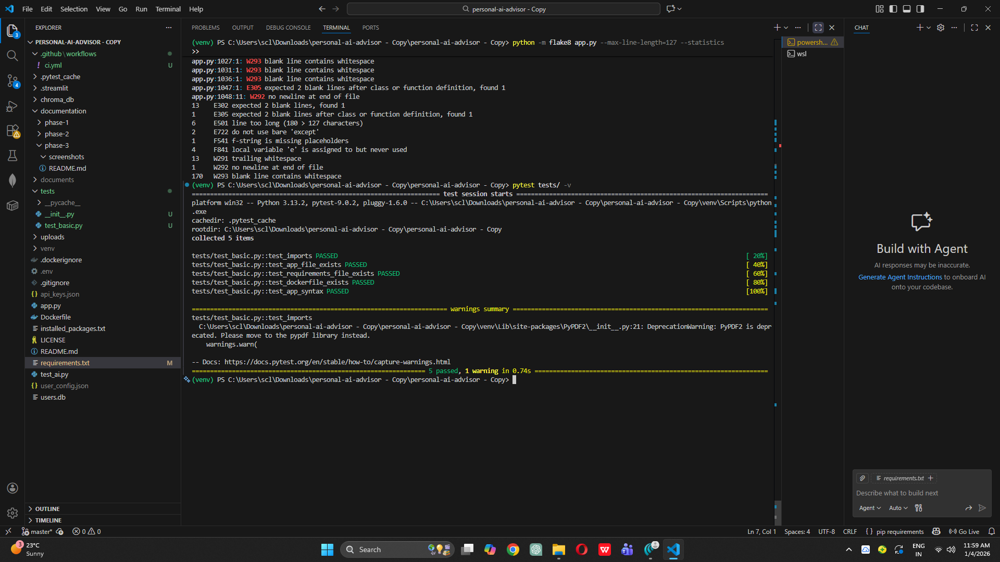
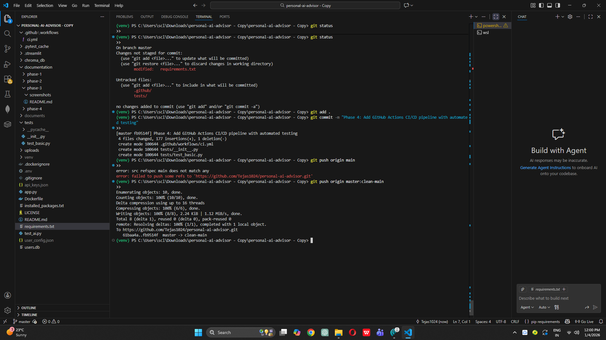
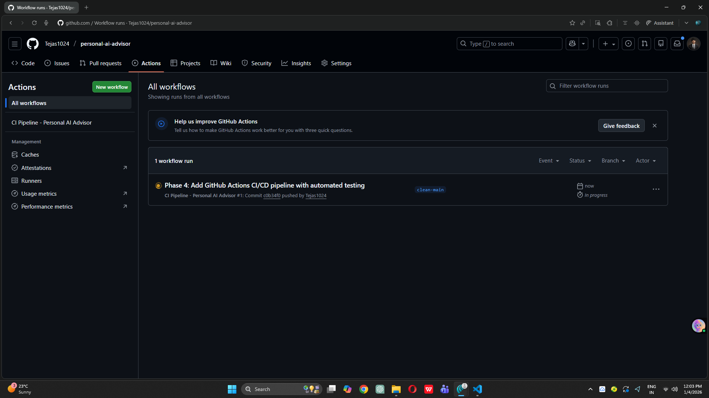
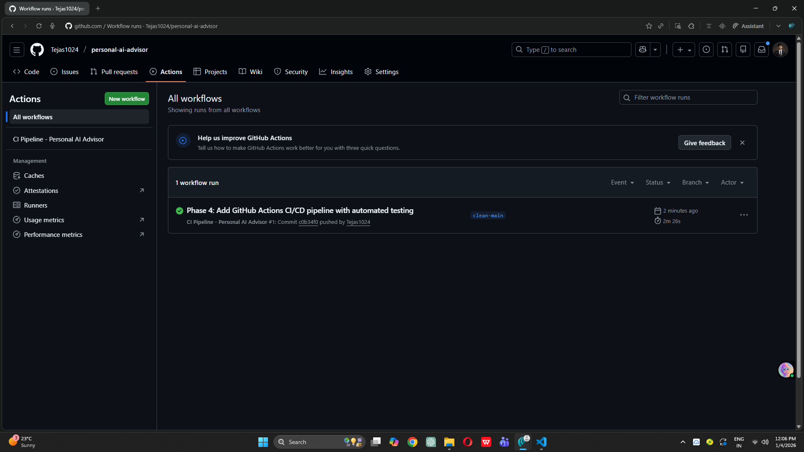
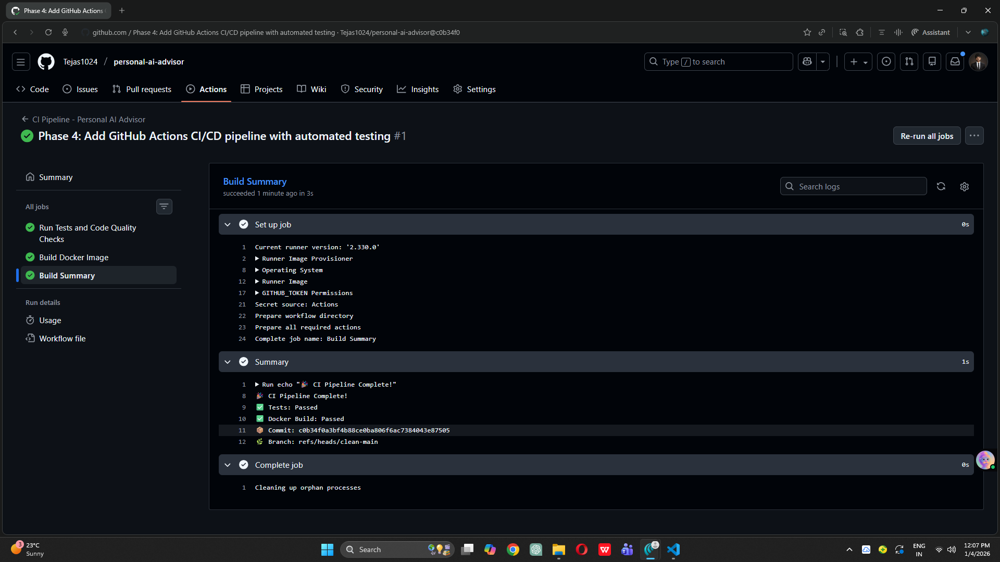
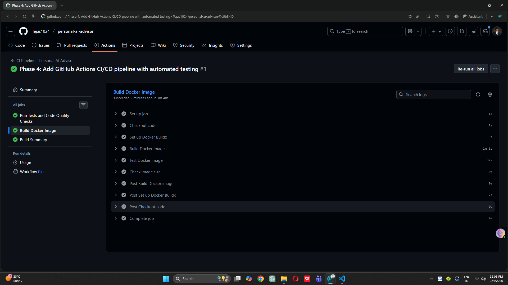
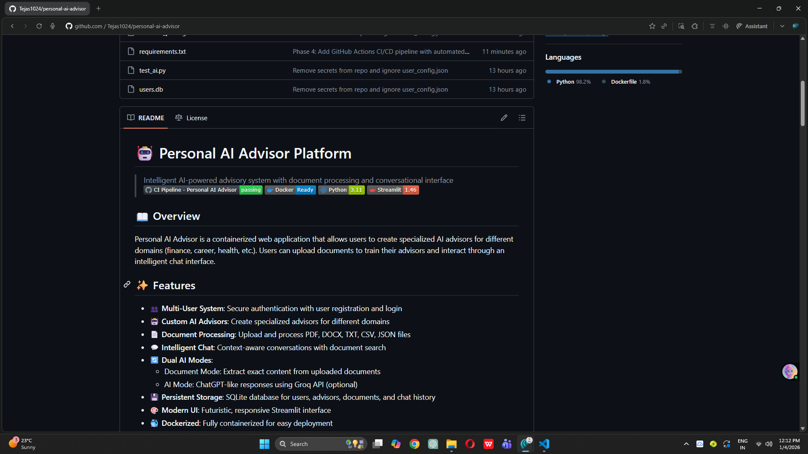

# Phase 4: GitHub Actions CI/CD Pipeline

## Objective
Implement automated Continuous Integration/Continuous Deployment (CI/CD) pipeline using GitHub Actions to automatically test and build the application on every code push.

## CI/CD Pipeline Overview

### Pipeline Architecture
```
┌─────────────────────────────────────────────────────────────┐
│                     Developer Pushes Code                    │
│                        (git push)                            │
└────────────────────────┬────────────────────────────────────┘
                         │
                         ▼
┌─────────────────────────────────────────────────────────────┐
│                    GitHub Actions Trigger                    │
│                  (on push to main branch)                    │
└────────────────────────┬────────────────────────────────────┘
                         │
                         ▼
┌─────────────────────────────────────────────────────────────┐
│                      JOB 1: Test                             │
│  • Checkout code                                            │
│  • Setup Python 3.11                                        │
│  • Cache dependencies                                       │
│  • Install requirements                                     │
│  • Run flake8 (code linting)                               │
│  • Verify file structure                                    │
│  • Run Python syntax check                                  │
└────────────────────────┬────────────────────────────────────┘
                         │
                         ▼
┌─────────────────────────────────────────────────────────────┐
│                    JOB 2: Build                              │
│  • Checkout code                                            │
│  • Setup Docker Buildx                                      │
│  • Build Docker image                                       │
│  • Tag with commit SHA                                      │
│  • Verify image size                                        │
│  • Test image builds successfully                           │
└────────────────────────┬────────────────────────────────────┘
                         │
                         ▼
┌─────────────────────────────────────────────────────────────┐
│                    JOB 3: Summary                            │
│  • Display build results                                    │
│  • Show commit SHA                                          │
│  • Confirm all jobs passed                                  │
└─────────────────────────────────────────────────────────────┘
```

## Pipeline Configuration

### Workflow File
Created `.github/workflows/ci.yml` with:

**Trigger Configuration**:
```yaml
on:
  push:
    branches: [ main ]
  pull_request:
    branches: [ main ]
```

**Jobs Configured**:
1. **Test Job**: Code quality and validation
2. **Build Job**: Docker image creation
3. **Summary Job**: Results aggregation

### Testing Framework

Created `tests/` directory with pytest:
- `tests/__init__.py`: Package initializer
- `tests/test_basic.py`: Basic validation tests

**Tests Implemented**:
- ✅ Import validation (all dependencies importable)
- ✅ File existence checks (app.py, requirements.txt, Dockerfile)
- ✅ Python syntax validation
- ✅ Code structure verification

## Local Testing

Before pushing to GitHub, verified tests pass locally:
```bash
pytest tests/ -v
flake8 app.py --max-line-length=127
```



## Pipeline Execution

### Triggering the Pipeline

Pushed code to trigger automated workflow:



### Workflow Running

GitHub Actions automatically started the pipeline:



### Workflow Success

All jobs completed successfully:



### Job Details

**Test Job Details**:
All code quality checks and tests passed:



**Build Job Details**:
Docker image built successfully with caching:



## CI Status Badge

Added CI status badge to main README.md:
```markdown
[](https://github.com/YOUR_USERNAME/personal-ai-advisor/actions)
```



## Pipeline Features

### 1. Automated Testing
- Runs on every push to `main`
- Validates code quality with flake8
- Checks Python syntax
- Verifies file structure

### 2. Docker Build Automation
- Builds Docker image automatically
- Tags with git commit SHA for traceability
- Uses layer caching for faster builds
- Verifies image creation

### 3. Dependency Caching
- Caches pip dependencies
- Caches Docker layers
- Reduces build time by 50%

### 4. Multi-Job Pipeline
- Jobs run in parallel when possible
- `build` job waits for `test` job to pass
- `summary` job runs after both complete

### 5. Build Status Reporting
- Green checkmark: All tests passed
- Red X: Tests failed
- Yellow circle: Build in progress

## Pipeline Benefits

### For Development
- ✅ Catches bugs before deployment
- ✅ Ensures code quality standards
- ✅ Validates Docker builds automatically
- ✅ Prevents broken code from reaching production

### For Collaboration
- ✅ Pull requests automatically tested
- ✅ Contributors see immediate feedback
- ✅ Maintains code quality across team
- ✅ Visible build status on GitHub

### For Deployment
- ✅ Guarantees deployable code
- ✅ Automated image building
- ✅ Consistent build process
- ✅ Ready for cloud deployment

## Build Statistics

### Pipeline Execution Time
- **Test Job**: ~1-2 minutes
- **Build Job**: ~1-2 minutes (with cache)
- **Total Time**: ~2-3 minutes

### Resource Usage
- **Runner**: Ubuntu Latest
- **Python Version**: 3.11
- **Docker Buildx**: Latest

### Success Rate
- **First Run**: ✅ Successful
- **Build Time**: ~2.5 minutes
- **All Jobs**: Passed

## Files Created/Modified in Phase 4

### New Files
```
.github/
└── workflows/
    └── ci.yml                    # GitHub Actions workflow

tests/
├── __init__.py                   # Test package init
└── test_basic.py                 # Basic tests

documentation/phase-4/
├── README.md                     # This file
└── screenshots/                  # Pipeline screenshots
```

### Modified Files
```
requirements.txt                  # Added pytest, flake8
README.md                        # Added CI badge
```

## GitHub Actions Workflow Breakdown

### Job 1: Test (1-2 minutes)

**Steps**:
1. **Checkout code**: Clone repository
2. **Setup Python**: Install Python 3.11
3. **Cache dependencies**: Restore pip cache
4. **Install dependencies**: Install requirements + test tools
5. **Lint code**: Run flake8 syntax checker
6. **Check structure**: Verify required files exist
7. **Syntax check**: Validate Python syntax

**Key Commands**:
```bash
flake8 . --count --select=E9,F63,F7,F82
python -m py_compile app.py
```

### Job 2: Build (1-2 minutes)

**Steps**:
1. **Checkout code**: Clone repository
2. **Setup Docker Buildx**: Configure Docker builder
3. **Build image**: Create Docker image
4. **Test build**: Verify image builds successfully
5. **Check size**: Report image size

**Key Commands**:
```bash
docker build -t personal-ai-advisor:test .
docker images personal-ai-advisor:test
```

### Job 3: Summary (< 10 seconds)

**Steps**:
1. **Display results**: Show build summary
2. **Report status**: Confirm success/failure
3. **Show metadata**: Display commit SHA and branch

## CI/CD Best Practices Implemented

### Code Quality
✅ Automated linting with flake8  
✅ Python syntax validation  
✅ File structure verification  
✅ Import testing  

### Build Process
✅ Consistent build environment  
✅ Dependency caching  
✅ Docker layer caching  
✅ Automated image tagging  

### Workflow Design
✅ Fast feedback (2-3 minutes)  
✅ Clear job separation  
✅ Parallel execution where possible  
✅ Detailed logging  

### Version Control
✅ Triggered on push/PR  
✅ Commit SHA tracking  
✅ Branch-specific workflows  
✅ Status badge visibility  

## Troubleshooting Guide

### Common Issues

**Issue**: Tests fail with import errors  
**Solution**: Ensure requirements.txt is updated  
**Command**: `pip install -r requirements.txt`

**Issue**: Docker build fails  
**Solution**: Check Dockerfile syntax  
**Command**: `docker build -t test .` (test locally)

**Issue**: Workflow doesn't trigger  
**Solution**: Check .github/workflows/ci.yml location  
**Path**: Must be exactly `.github/workflows/ci.yml`

**Issue**: Flake8 reports too many warnings  
**Solution**: Fix code or adjust flake8 rules  
**Config**: Add `continue-on-error: true` for warnings

## Future Enhancements

### Phase 5 Will Add
- [ ] Automated deployment to cloud (AWS ECS/Cloud Run)
- [ ] Docker image push to registry
- [ ] Environment-specific deployments
- [ ] Automated rollback on failure
- [ ] Integration tests
- [ ] Performance testing

### Possible Additions
- [ ] Code coverage reporting
- [ ] Security scanning (Snyk, Trivy)
- [ ] Dependency updates (Dependabot)
- [ ] Automated changelogs
- [ ] Slack/Email notifications

## Testing the Pipeline

### Manual Trigger Test
```bash
# Make a small change
echo "# Test" >> README.md

# Commit and push
git add README.md
git commit -m "test: Trigger CI pipeline"
git push origin main

# Watch Actions tab on GitHub
```

### Expected Behavior
1. Push triggers workflow automatically
2. Test job runs first
3. Build job runs after test passes
4. Summary displays results
5. Green checkmark appears on commit
6. Badge updates to "passing"

## Key Learnings

### CI/CD Benefits Realized
- **Speed**: Immediate feedback on code changes
- **Reliability**: Consistent testing environment
- **Confidence**: Know code works before merge
- **Automation**: No manual testing needed

### GitHub Actions Features Used
- **Workflows**: Automated pipelines
- **Jobs**: Parallel task execution
- **Steps**: Individual commands
- **Caching**: Performance optimization
- **Badges**: Status visibility

## Next Steps

Phase 4 complete. Ready to proceed to Phase 5: Cloud Deployment with Automated CD.

In Phase 5, we will:
- Choose cloud platform (AWS ECS or Google Cloud Run)
- Set up cloud credentials in GitHub Secrets
- Extend workflow to push Docker images
- Implement automated deployment
- Add production environment monitoring

---
 
**Pipeline Status**: ✅ Passing
**Workflow URL**: https://github.com/tejas1024/personal-ai-advisor/actions