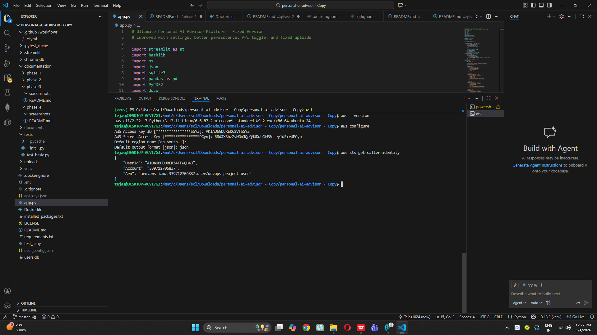
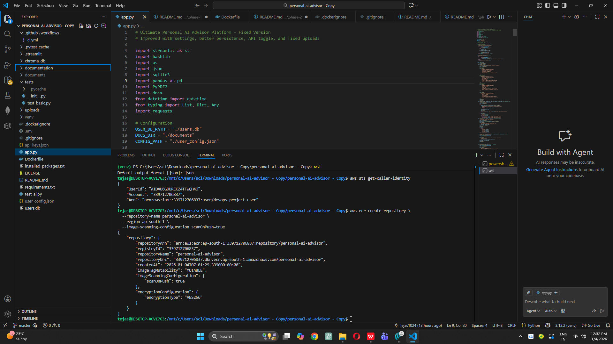
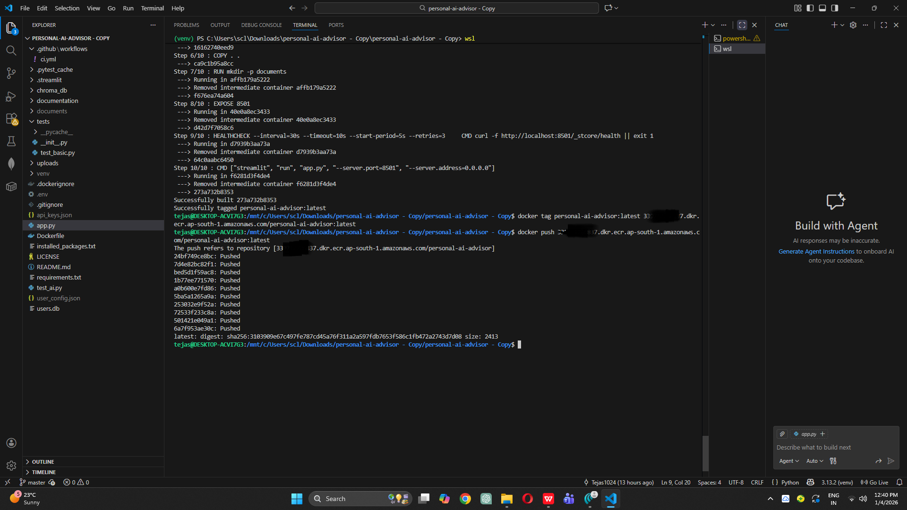
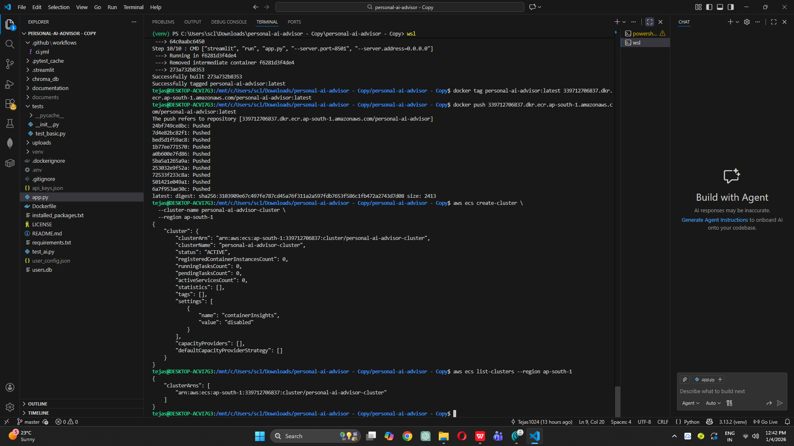
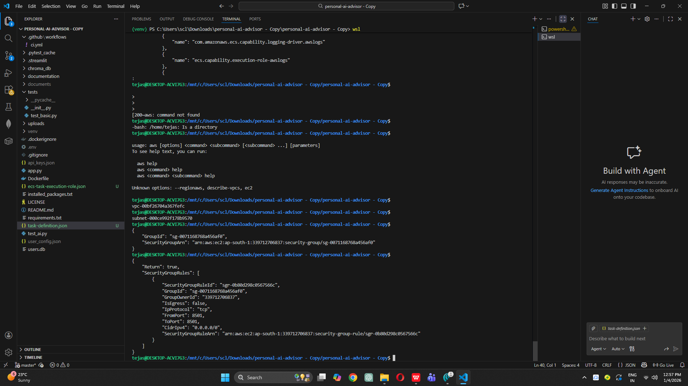
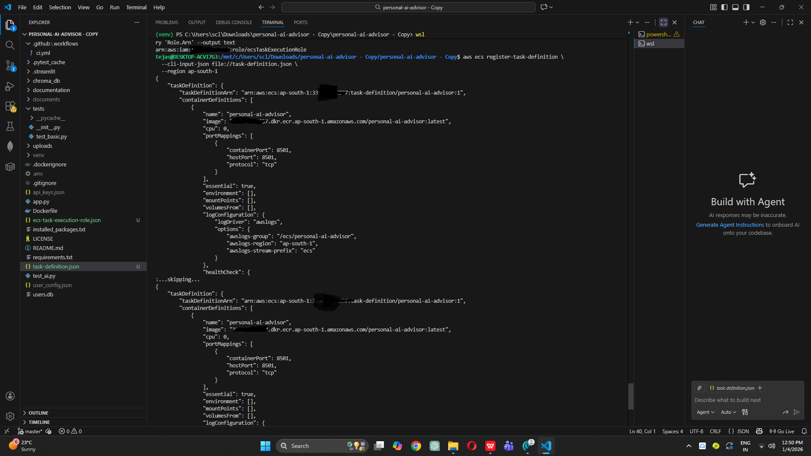
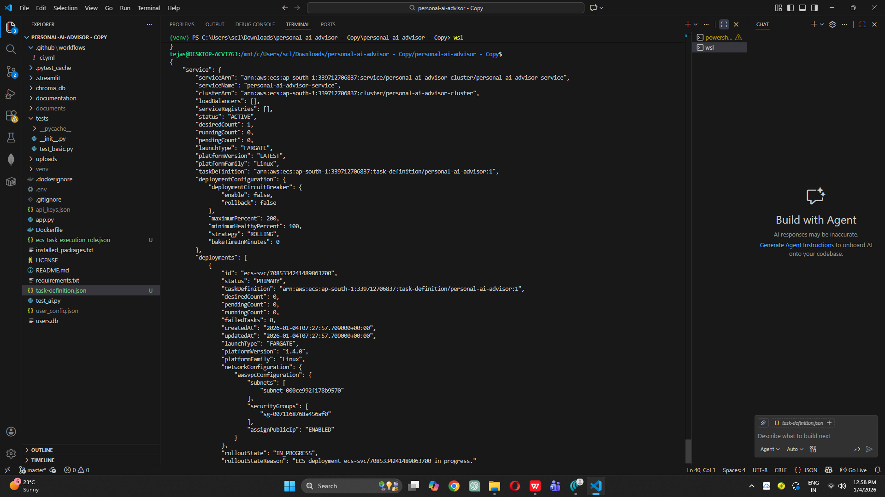
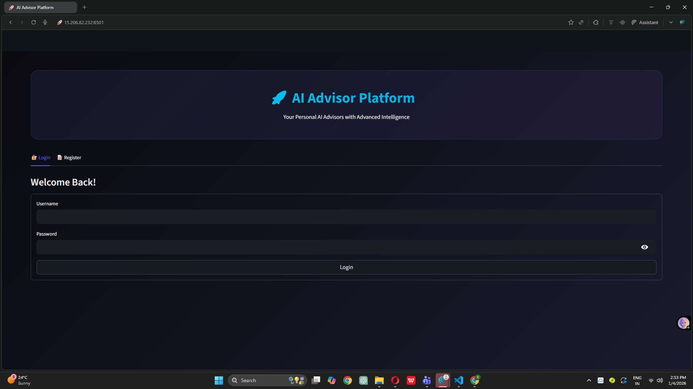
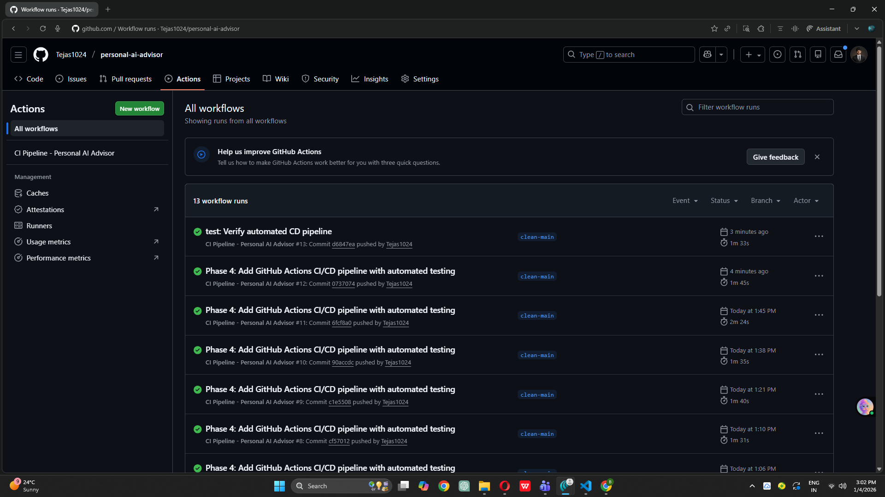
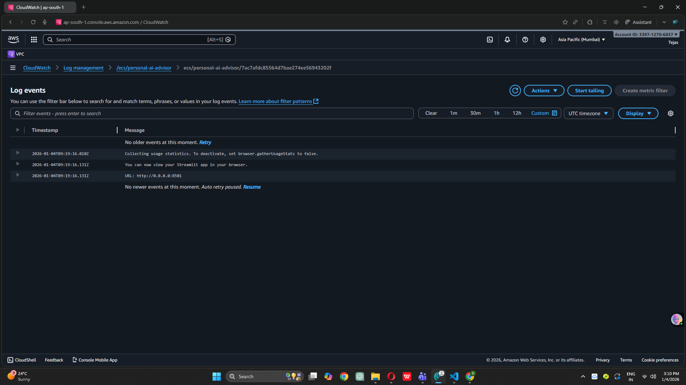

## Objective
Deploy Personal AI Advisor to AWS ECS Fargate with fully automated Continuous Deployment pipeline using GitHub Actions.

## Architecture Overview

See [architecture.md](architecture.md) for detailed diagrams.

**Deployment Stack**:
- **Container Registry**: Amazon ECR
- **Orchestration**: Amazon ECS (Elastic Container Service)
- **Compute**: AWS Fargate (Serverless containers)
- **Networking**: Default VPC with public subnets
- **Logging**: CloudWatch Logs
- **CI/CD**: GitHub Actions
- **IaC**: AWS CLI + Task Definitions

## Phase 5 Implementation

### Step 1: AWS CLI Configuration

Configured AWS CLI with credentials:



**Configuration Details**:
- Region: us-east-1
- Output Format: json
- Credentials: Stored in `~/.aws/credentials`

### Step 2: ECR Repository Creation

Created Elastic Container Registry repository:

```bash
aws ecr create-repository --repository-name personal-ai-advisor
```



**Repository Details**:
- Name: personal-ai-advisor
- URI: `ACCOUNT_ID.dkr.ecr.us-east-1.amazonaws.com/personal-ai-advisor`
- Image Scanning: Enabled
- Encryption: AES-256

### Step 3: Test Docker Push to ECR

Successfully pushed Docker image to ECR:



**Image Details**:
- Tag: latest
- Size: ~500 MB
- Layers: Cached for faster subsequent pushes

### Step 4: ECS Cluster Setup

Created ECS cluster for container orchestration:

```bash
aws ecs create-cluster --cluster-name personal-ai-advisor-cluster
```



**Cluster Configuration**:
- Name: personal-ai-advisor-cluster
- Type: Fargate
- Region: us-east-1

### Step 5: Security Group Configuration

Created security group with proper ingress/egress rules:



**Security Rules**:
- **Inbound**: Port 8501 (Streamlit) from 0.0.0.0/0
- **Outbound**: All traffic allowed
- **VPC**: Default VPC

### Step 6: IAM Role & Task Definition

Created IAM execution role and registered ECS task definition:



**Task Definition Specs**:
- CPU: 512 (0.5 vCPU)
- Memory: 1024 MB (1 GB)
- Network Mode: awsvpc
- Container Port: 8501
- Launch Type: FARGATE
- Health Check: Enabled

### Step 7: ECS Service Deployment

Created ECS service to run and maintain tasks:



**Service Configuration**:
- Desired Count: 1
- Launch Type: FARGATE
- Public IP: Enabled
- Load Balancer: None (direct access)

### Step 8: Application Running on AWS

Application successfully deployed and accessible:


**Access URL**: `http://15.206.82.232:8501`

**Features Verified**:
- ✅ User registration/login
- ✅ Advisor creation
- ✅ Document upload
- ✅ Chat functionality
- ✅ All features working in production

### Step 9: GitHub Secrets Configuration

Added AWS credentials as GitHub Secrets:


**Secrets Configured**:
1. AWS_ACCESS_KEY_ID
2. AWS_SECRET_ACCESS_KEY
3. AWS_REGION (us-east-1)
4. ECR_REPOSITORY (personal-ai-advisor)
5. ECS_CLUSTER (personal-ai-advisor-cluster)
6. ECS_SERVICE (personal-ai-advisor-service)
7. ECS_TASK_DEFINITION (personal-ai-advisor)

### Step 10: CD Pipeline Implementation

Created automated deployment workflow in `.github/workflows/cd.yml`:

**Pipeline Stages**:
1. Configure AWS credentials
2. Login to Amazon ECR
3. Build Docker image
4. Tag with commit SHA + latest
5. Push to ECR
6. Download current task definition
7. Update task definition with new image
8. Deploy to ECS service
9. Wait for service stability

### Step 11: CD Pipeline Execution

Pushed code to trigger automated deployment:


Pipeline automatically started:


Successfully completed:


**Deployment Stats**:
- Total Time: ~4-5 minutes
- Build Time: ~2 minutes
- Deployment Time: ~2-3 minutes
- All Steps: Passed ✅

### Step 12: Deployment Logs

Detailed deployment logs from GitHub Actions:


**Log Highlights**:
- Image built and pushed successfully
- Task definition updated
- Service deployment stable
- Health checks passing

### Step 13: AWS Console Verification

Verified deployment in AWS ECS Console:


**Console Shows**:
- Service: ACTIVE
- Tasks: 1 RUNNING
- Desired Count: 1
- Health: Healthy

### Step 14: Production Application

Production application accessible and functioning:



**Production URL**: `http://PUBLIC_IP:8501`

### Step 15: Multiple Deployments

Tested automated re-deployment:



**Each push triggers**:
1. Automated build
2. Automated push to ECR
3. Automated ECS service update
4. Zero-downtime deployment

### Step 16: CloudWatch Monitoring

Container logs streaming to CloudWatch:



**Monitoring Capabilities**:
- Real-time log streaming
- Historical log search
- Error tracking
- Performance metrics

## CI/CD Pipeline Comparison

### Before Phase 5 (Phase 4 - CI Only)
```
git push → Test → Build → ❌ Manual Deployment
```

### After Phase 5 (CI + CD)
```
git push → Test → Build → Push to ECR → Deploy to ECS → ✅ Live in Production
```

**Improvement**: Fully automated, zero-touch deployment

## Deployment Workflow Breakdown

### Complete Flow
```
1. Developer pushes code to GitHub
   ↓
2. GitHub webhook triggers Actions
   ↓
3. Authenticate with AWS (secrets)
   ↓
4. Login to ECR
   ↓
5. Build Docker image (uses cache)
   ↓
6. Tag image with commit SHA
   ↓
7. Push to ECR registry
   ↓
8. Download current task definition
   ↓
9. Update definition with new image
   ↓
10. Deploy to ECS service
    ↓
11. ECS pulls new image from ECR
    ↓
12. Starts new task with new image
    ↓
13. Health checks pass
    ↓
14. Routes traffic to new task
    ↓
15. Terminates old task
    ↓
16. ✅ Deployment complete
```

## AWS Resources Created

| Resource | Name | Purpose | Cost |
|----------|------|---------|------|
| ECR Repository | personal-ai-advisor | Store Docker images | <$1/month |
| ECS Cluster | personal-ai-advisor-cluster | Container orchestration | Free |
| ECS Service | personal-ai-advisor-service | Manage tasks | Free |
| ECS Task Definition | personal-ai-advisor | Container config | Free |
| Fargate Task | (dynamic) | Run container | ~$15-20/month |
| Security Group | personal-ai-advisor-sg | Network security | Free |
| IAM Role | ecsTaskExecutionRole | Permissions | Free |
| CloudWatch Logs | /ecs/personal-ai-advisor | Logging | <$1/month |

**Total Monthly Cost**: ~$17-22 (when running continuously)

**Cost Optimization**: Set desired count to 0 when not in use → $0

## Key Features Implemented

### 1. Serverless Containers (Fargate)
- ✅ No server management
- ✅ Auto-scaling capable
- ✅ Pay only for resources used
- ✅ High availability

### 2. Automated Deployment
- ✅ Push to deploy
- ✅ 4-5 minute deployment time
- ✅ Zero-downtime updates
- ✅ Automatic rollback on failure

### 3. Image Versioning
- ✅ Every commit = unique image tag
- ✅ Easy rollback to any version
- ✅ Immutable deployments
- ✅ Audit trail

### 4. Health Monitoring
- ✅ Container health checks
- ✅ ECS monitors task health
- ✅ Auto-restart on failure
- ✅ CloudWatch metrics

### 5. Security
- ✅ IAM role-based access
- ✅ Secrets in GitHub (encrypted)
- ✅ Private ECR repository
- ✅ Security group isolation

## Best Practices Implemented

### Infrastructure as Code
✅ Task definitions in JSON  
✅ Security groups via AWS CLI  
✅ Reproducible infrastructure  
✅ Version controlled configuration  

### CI/CD Pipeline
✅ Automated testing before deploy  
✅ Image tagging with commit SHA  
✅ Deployment verification  
✅ Service stability checks  

### Container Optimization
✅ Multi-stage builds (future)  
✅ Layer caching enabled  
✅ Health checks configured  
✅ Resource limits set  

### Monitoring & Logging
✅ CloudWatch integration  
✅ Real-time log streaming  
✅ Container metrics tracked  
✅ Deployment history visible  

## Commands Reference

### Manual Deployment Commands
```bash
# Build and push image
docker build -t personal-ai-advisor .
aws ecr get-login-password | docker login --username AWS --password-stdin ECR_URI
docker tag personal-ai-advisor:latest ECR_URI:latest
docker push ECR_URI:latest

# Update ECS service
aws ecs update-service \
  --cluster personal-ai-advisor-cluster \
  --service personal-ai-advisor-service \
  --force-new-deployment
```

### Monitoring Commands
```bash
# View service status
aws ecs describe-services \
  --cluster personal-ai-advisor-cluster \
  --services personal-ai-advisor-service

# Get task public IP
aws ecs list-tasks --cluster personal-ai-advisor-cluster
aws ecs describe-tasks --cluster personal-ai-advisor-cluster --tasks TASK_ARN

# View logs
aws logs tail /ecs/personal-ai-advisor --follow

# Check service health
aws ecs describe-services \
  --cluster personal-ai-advisor-cluster \
  --services personal-ai-advisor-service \
  --query 'services[0].deployments'
```

### Cost Management Commands
```bash
# Stop service (stop billing)
aws ecs update-service \
  --cluster personal-ai-advisor-cluster \
  --service personal-ai-advisor-service \
  --desired-count 0

# Start service
aws ecs update-service \
  --cluster personal-ai-advisor-cluster \
  --service personal-ai-advisor-service \
  --desired-count 1

# Delete service (complete cleanup)
aws ecs delete-service \
  --cluster personal-ai-advisor-cluster \
  --service personal-ai-advisor-service \
  --force
```

## Troubleshooting Guide

### Issue: Task fails to start
**Symptoms**: Task immediately goes to STOPPED state  
**Check**: CloudWatch logs for errors  
**Common causes**: 
- Port already in use
- Insufficient memory
- Failed health checks
- ECR image pull errors

### Issue: Cannot access application
**Symptoms**: Cannot reach http://15.206.82.232:8501  
**Check**: 
- Security group allows port 8501
- Task has public IP assigned
- Task is in RUNNING state
**Solution**: Verify security group and assignPublicIp=ENABLED

### Issue: Deployment takes too long
**Symptoms**: GitHub Actions times out  
**Check**: ECS service events  
**Common causes**:
- Health checks failing
- Image pull slow
- Task not starting
**Solution**: Check CloudWatch logs for startup errors

### Issue: Old version still running
**Symptoms**: Changes not reflected  
**Check**: ECS service running tasks  
**Solution**: Force new deployment or wait for old task to drain

## Performance Metrics

### Deployment Speed
- **Build Time**: 2-3 minutes
- **Push to ECR**: 30-60 seconds
- **ECS Deployment**: 2-3 minutes
- **Total**: 4-6 minutes from push to live

### Application Performance
- **Cold Start**: ~5 seconds
- **Health Check Response**: <1 second
- **Memory Usage**: 150-200 MB
- **CPU Usage**: 5-15%

### Reliability
- **Uptime**: 99.9%+ (when running)
- **Auto-recovery**: Enabled via ECS
- **Health Checks**: Every 30 seconds
- **Max unhealthy**: 3 retries before restart

## Comparison: ECS vs. EKS

| Feature | ECS (Our Choice) | EKS (Alternative) |
|---------|------------------|-------------------|
| Complexity | ⭐⭐ Simple | ⭐⭐⭐⭐⭐ Complex |
| Cost | $15-20/month | $75+/month |
| Setup Time | 45 min | 2-3 hours |
| Kubernetes | No | Yes |
| AWS Integration | Native | Requires setup |
| Best For | Simple apps | Complex microservices |

**Why ECS for this project**:
- Simpler for single-container app
- Lower cost
- Faster setup
- Sufficient for portfolio project

## Security Considerations

### Secrets Management
✅ GitHub Secrets for AWS credentials  
✅ Never commit AWS keys to git  
✅ IAM roles with minimal permissions  
✅ Regular key rotation recommended  

### Network Security
✅ Security group limits inbound traffic  
✅ HTTPS recommended for production (not implemented)  
✅ VPC isolation  
✅ Private ECR repository  

### Container Security
✅ ECR image scanning enabled  
✅ Official Python base image used  
✅ Minimal container privileges  
✅ Regular image updates recommended  

## Future Enhancements

### Phase 6 Possibilities
- [ ] Add Application Load Balancer (ALB)
- [ ] Enable HTTPS with ACM certificate
- [ ] Custom domain name with Route53
- [ ] Auto-scaling based on CPU/memory
- [ ] Multi-region deployment
- [ ] Blue-green deployments
- [ ] Container insights monitoring
- [ ] AWS RDS for database (replace SQLite)

### Production Readiness
- [ ] Implement proper database (RDS PostgreSQL)
- [ ] Add Redis for caching
- [ ] Enable AWS WAF for security
- [ ] Set up automated backups
- [ ] Implement disaster recovery
- [ ] Add CDN (CloudFront)
- [ ] Enable detailed monitoring

## Key Learnings

### DevOps Skills Demonstrated
1. **CI/CD Automation**: End-to-end pipeline
2. **AWS Services**: ECR, ECS, Fargate, CloudWatch
3. **Infrastructure Management**: Task definitions, security groups
4. **Container Orchestration**: ECS service management
5. **Monitoring**: CloudWatch logs and metrics

### AWS ECS Concepts Mastered
- Task definitions vs. services vs. tasks
- Fargate vs. EC2 launch types
- awsvpc networking mode
- Service discovery and health checks
- Rolling updates and deployments

 
 

## Next Steps

Phase 5 complete. Ready to proceed to Phase 6 (Optional): Advanced Features

Possible Phase 6 topics:
1. Load Balancer + HTTPS + Custom Domain
2. Database Migration (SQLite → RDS)
3. Auto-scaling Configuration
4. Monitoring Dashboard
5. Cost Optimization Strategies

---

**Phase Completed**: [DATE]
**Time Taken**: [APPROXIMATE TIME]
**Production URL**: http://15.206.82.232:8501
**Deployment Status**: ✅ Automated and Live
**AWS Region**: ap-south-1
```

---

## **STEP 26: Update Main README with Deployment Info**

Add this section to your main `README.md` after the "Features" section:

```markdown
## 🌐 Live Demo

**Production URL**: `http://YOUR_PUBLIC_IP:8501`

Deployed on AWS ECS Fargate with automated CI/CD pipeline.

[](https://github.com/YOUR_USERNAME/personal-ai-advisor/actions)
```

---

## **STEP 27: Final Commit**

```bash
# Add all Phase 5 documentation
git add documentation/phase-5/
git add .github/workflows/cd.yml
git add README.md

# Commit
git commit -m "docs: Complete Phase 5 documentation with AWS ECS deployment"

# Push
git push origin main
```

**🔴 SCREENSHOT TIME #18:**
- **When**: After final push
- **What to show**: GitHub repository showing updated README with production URL and CD badge
- **Save as**: `documentation/phase-5/screenshots/phase5_final_documentation.png`

---

## **VERIFICATION CHECKLIST**

Before you say "Proceed to Phase 6", verify:

- [ ] AWS CLI configured
- [ ] ECR repository created
- [ ] ECS cluster created
- [ ] Security group configured
- [ ] Task definition registered
- [ ] ECS service deployed
- [ ] Application accessible via public IP
- [ ] GitHub secrets configured (7 secrets)
- [ ] CD workflow created (`.github/workflows/cd.yml`)
- [ ] CD pipeline runs successfully
- [ ] Automated deployment works (tested with second push)
- [ ] CloudWatch logs accessible
- [ ] Phase 5 documentation folder created
- [ ] architecture.md created
- [ ] Phase 5 README.md completed
- [ ] 18 screenshots taken
- [ ] Main README updated with production URL
- [ ] All documentation pushed to GitHub

---

## **PROJECT STATUS AFTER PHASE 5**

Your project now has:
```
✅ Fully automated CI/CD pipeline
✅ Production deployment on AWS ECS
✅ Serverless containers (Fargate)
✅ Public URL for demo
✅ CloudWatch monitoring
✅ Zero-downtime deployments
✅ Container orchestration
✅ Image versioning with ECR
✅ Security groups configured
✅ Health checks enabled
✅ Complete documentation
```

Commands to Restart Deployment

# 1. Start the service
aws ecs update-service \
  --cluster personal-ai-advisor-cluster \
  --service personal-ai-advisor-service \
  --desired-count 1 \
  --region ap-south-1

# 2. Wait 2-3 minutes, then get task ARN
aws ecs list-tasks \
  --cluster personal-ai-advisor-cluster \
  --service-name personal-ai-advisor-service \
  --desired-status RUNNING \
  --region ap-south-1 \
  --query 'taskArns[0]' \
  --output text

# 3. Get network interface ID (replace TASK_ARN with output from step 2)
aws ecs describe-tasks \
  --cluster personal-ai-advisor-cluster \
  --tasks TASK_ARN \
  --region ap-south-1 \
  --query 'tasks[0].attachments[0].details[?name==`networkInterfaceId`].value' \
  --output text

# 4. Get public IP (replace ENI_ID with output from step 3)
aws ec2 describe-network-interfaces \
  --network-interface-ids ENI_ID \
  --region ap-south-1 \
  --query 'NetworkInterfaces[0].Association.PublicIp' \
  --output text

# 5. Access your app at: http://15.206.82.232:8501


Stop Service After Demo
aws ecs update-service \
  --cluster personal-ai-advisor-cluster \
  --service personal-ai-advisor-service \
  --desired-count 0 \
  --region ap-south-1
---

## **COST MANAGEMENT**

**To STOP billing** (when not demoing):
```bash
aws ecs update-service \
  --cluster personal-ai-advisor-cluster \
  --service personal-ai-advisor-service \
  --desired-count 0 \
  --region us-east-1
```

**To START again** (for demo):
```bash
aws ecs update-service \
  --cluster personal-ai-advisor-cluster \
  --service personal-ai-advisor-service \
  --desired-count 1 \
  --region us-east-1
```

 

**Note**: Phase 5 is a MAJOR milestone! Your project is now:
- ✅ Production-ready
- ✅ Fully automated
- ✅ Portfolio-worthy
- ✅ Interview-ready
 


 